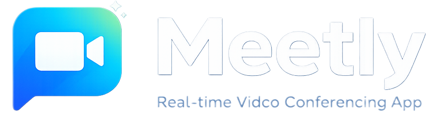
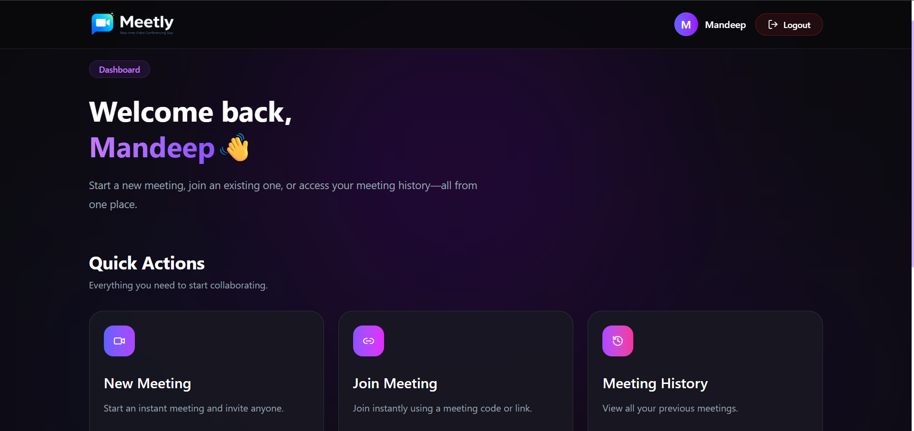
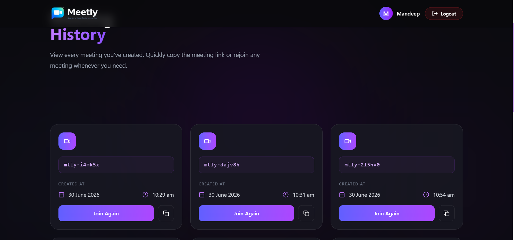

<div align="center">
  <br /><br />

  <h1>Meetly</h1>
  <p>Modern real-time video conferencing platform built with the MERN Stack, WebRTC, and Socket.IO.</p>
  <sub>
    Secure authentication • Peer-to-peer video • Screen sharing • Live chat • Meeting history
  </sub>

  <br /><br />

  <a href="https://meetly-live.vercel.app">
    
  </a>
  &nbsp;
  <a href="https://github.com/mandeepparmar/meetly">
    
  </a>

  <br /><br />

  
  
  
  
  
  
  

  <br /><br />

</div>

<br />

## Overview

**Meetly** is a full-stack, real-time video conferencing application built entirely from scratch using the **MERN stack**, **WebRTC**, and **Socket.IO**. It lets users instantly create or join meetings via a unique meeting code or shareable link — no downloads, no friction.

Meetly was built to demonstrate a production-grade understanding of real-time systems: peer-to-peer media negotiation, signaling servers, stateful socket rooms, secure authentication flows, and a polished, responsive UI — all wired together into a cohesive product rather than a collection of tutorials stitched together.

<br />

## Project Highlights

-  &nbsp;Built completely from scratch — no video SDK
-  &nbsp;Secure JWT authentication with persistent sessions
-  &nbsp;Peer-to-peer video calls via WebRTC
-  &nbsp;Screen sharing mid-call
-  &nbsp;Real-time in-call chat via Socket.IO
-  &nbsp;Persistent meeting history per user
-  &nbsp;Guest join — no account required
-  &nbsp;Fully responsive across all screen sizes

<br />

## Features

<table>
<tr>
<td valign="top" width="25%">

**🔐 Authentication**
- Register & login
- JWT + persistent sessions
- bcrypt password hashing
- Guest join

</td>
<td valign="top" width="25%">

**🎥 Meetings**
- Lobby with camera & mic preview
- P2P video via WebRTC
- Screen sharing
- Camera & mic toggles
- Live timer · Copy link

</td>
<td valign="top" width="25%">

**💬 Chat**
- Real-time messaging
- Unread message badge
- Auto-scroll
- Timestamps

</td>
<td valign="top" width="25%">

**📊 Dashboard**
- Create & join meetings
- Meeting history log
- Rejoin or copy link
- Personalized UI

</td>
</tr>
</table>

<br />

## Screenshots

<table>
<tr>
  <td></td>
  <td></td>
</tr>
<tr>
  <td align="center"><sub>Landing Experience</sub></td>
  <td align="center"><sub>Dashboard</sub></td>
</tr>
<tr>
  <td></td>
  <td></td>
</tr>
<tr>
  <td align="center"><sub>Lobby Preview</sub></td>
  <td align="center"><sub>Meeting Room</sub></td>
</tr>
<tr>
  <td></td>
  <td></td>
</tr>
<tr>
  <td align="center"><sub>Live Chat</sub></td>
  <td align="center"><sub>Meeting History</sub></td>
</tr>
</table>

<br />

## 🛠️ Tech Stack

<div align="center">

| | |
|:--|:--|
| **Frontend** | React · Tailwind CSS · React Router · Context API · Axios · Lucide React |
| **Backend** | Node.js · Express · MongoDB · Mongoose · JWT · bcrypt |
| **Real-time** | Socket.IO · WebRTC |
| **Deployed on** | Vercel · Render |

<br />

</div>


## Getting Started

### Clone the repository

```bash
git clone https://github.com/<your-username>/meetly.git
cd meetly
```

### Install dependencies

```bash
# Install backend dependencies
cd backend
npm install

# Install frontend dependencies
cd ../frontend
npm install
```

---

### Environment Variables

Create a `.env` file inside the `backend/` directory with the following variables:

```env

# Database
MONGODB_URI=your_mongodb_connection_string

# Authentication
JWT_SECRET=your_jwt_secret_key

```

Create a `.env` file inside the `frontend/` directory:

```env
VITE_BACKEND_URL=http://localhost:4000

```

<br />


## 👨‍💻 Author

<div align="center">

**Built with 💜 by Mandeep Paramr**

Full-Stack Developer specializing in the MERN stack and real-time web applications

</div>

---

## 🔗 Connect With Me

<div align="center">

[](#)
[](#)
[](#)

</div>

---

<div align="center">
  <sub>⭐ If you found this project helpful, consider starring the repository.</sub><br />
  <sub>built with ❤️ by Mandeep Parmar.</sub>
</div>
